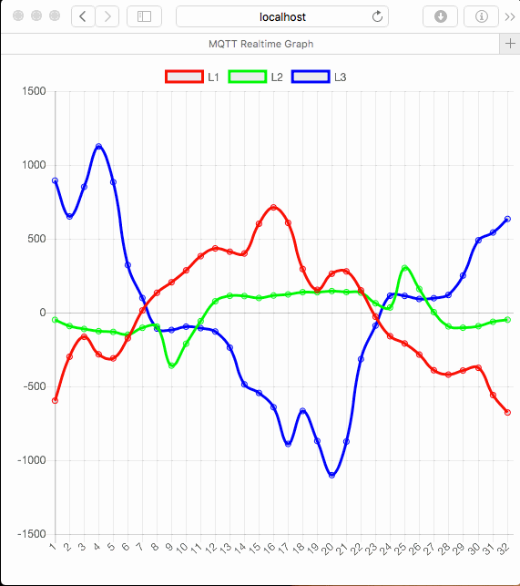

# MQTT Realtime Graph
As a tool to debug the new Fluksometer version 3 this little webserver enables a realtime graph of the provided voltage or current readings via MQTT over websockets (apply what you want in the [topic subscription](index.js#L34)).

If you want to use this also, make sure to change the mqtt broker's address in [mqttrealtime.js](index.js#L14) to that of your FLM03; start the server (whic actually just serves the [index.html](index.html)) with ```node mqttrealtime.js```.



This visualization uses [chart.js](http://www.chartjs.org/) and the [Paho MQTT over WebSockets client](https://eclipse.org/paho/clients/js/). The recording has been made with [LICEcap](http://www.cockos.com/licecap/). And as server environment I use [node.js](https://nodejs.org).

As usual, all code under MIT license; be fair!