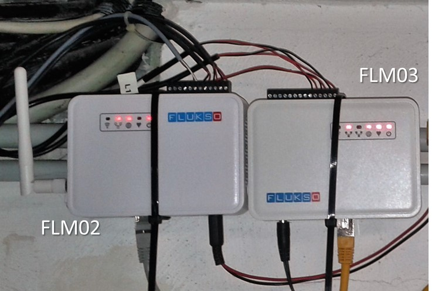

# flm03
Hacks for the next generation Fluksometer, version 3E (FLM03E) - find following sections providing diverse documentation on experience gained.

## MQTT handling
For the FLM03's MQTT features, refer to [MQTT.md](MQTT.md); for a tiny server to chart FLM03 readings, go to [MQTTrealtime](MQTTrealtime/).

## Local visualizations
Also the FLM03 can be tweaked to get an on-board visualization capability; for this, please refer to the corresponding [flmlocal flm03 branch](https://github.com/gebhardm/flmlocal/tree/flm03)

## Hardware additions
To interface one pulse meter with two pulse inputs, use a little "pulse doubler", described in [interfacing.md](interfacing.md)