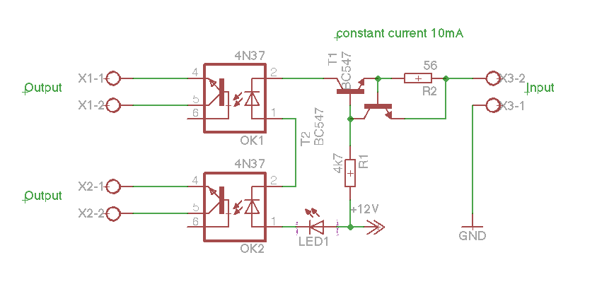

# Interfacing with the FLM
To run two Fluksometers in parallel, for using the same pulse meter on both, a little hack is necessary, distributing one pulse input to two, isolated outputs.
This is actually an "open collector doubler". The constant current source is used to get supply power from any DC source available (here the 12V supply of the FLM02).

